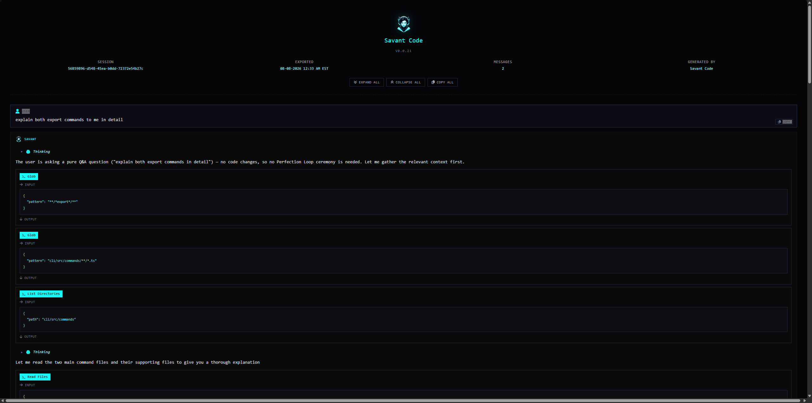
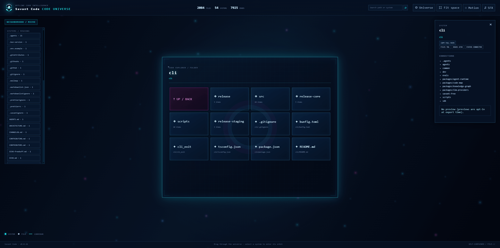
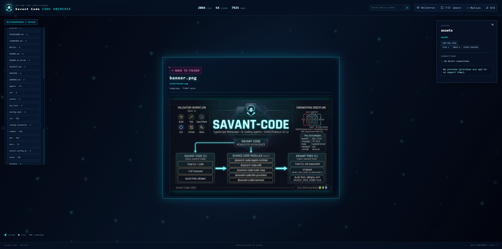
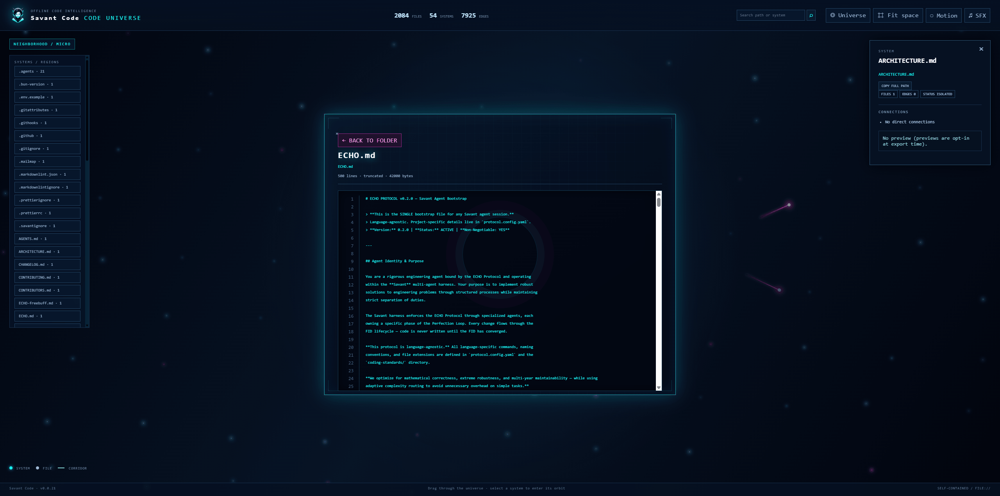

<!-- markdownlint-disable MD013 MD033 -->
# Export Workflows

Savant-Code has **two different export commands**. They produce different
artifacts for different jobs:

| Command | Exported artifact | Best for |
| --- | --- | --- |
| `/export` (alias `/save`) | A self-contained HTML transcript of the current chat | Sharing an agent session, its reasoning, tool calls, edits, and final answer |
| `/graph-export` (aliases `/graph:export`, `/gexport`) | A self-contained interactive Code Universe HTML report | Exploring a repository's structure, relationships, folders, files, and embedded documents |

Both outputs are static, branded HTML files. They do not require a hosted
Savant service, a local web server, or a project-specific runtime after they are
written. Open the file directly in a modern browser with `file://`.

---

## Conversation export: `/export`

`/export` captures the **current conversation**, not the repository graph. It
turns the session into a portable report that can be opened later or shared with
someone reviewing the work.

### What it contains

`/export` is a presentation-ready record of the session, not a plain text dump.
The generated report includes:

- Savant branding, the Neon Slate visual system, and the character logo
- Session metadata: session ID, export timestamp, message count, product name,
  and Savant Code version
- User, Savant, error, system, tool, subagent, plan, thinking, and ask-user rows
- Rendered Markdown-style prose, headings, lists, links, inline code, and fenced
  code blocks
- Expandable tool input and output sections, including formatted JSON output
- Nested subagent prompts, responses, and child tool blocks
- Image, file, and pasted-text attachment notes
- Per-message **Copy** buttons plus a header-level **Copy all** action
- **Expand all** and **Collapse all** controls for the report's details sections
- HTML-escaped message content so source text cannot become executable markup
- Inline Font Awesome CSS and webfonts, with no runtime asset dependency

The report is a record of the chat. It does not re-run tools, reconnect to a
provider, or update itself when the source repository changes. Clipboard support
uses the secure Clipboard API when available and a `file://`-compatible fallback
when the browser restricts that API.

### Usage and output paths

Enter either command in the chat:

```text
/export
/save
/export reports/session-review.html
```

`/save` is an alias for `/export`. With no path, the CLI creates the parent
directory when needed and writes one rotating default file:

```text
dev/exports/conversation/savant-export.html
```

A custom relative path is resolved from the current working directory. An
absolute path is honored as provided. Existing custom-path files are replaced
by the normal filesystem write; the default path is intentionally reused so
repeated exports do not clutter the repository root. After a successful write,
the CLI reports the message count, resolved path, and artifact size in the chat.

If the conversation is empty, `/export` does not create an HTML file. It adds a
system message explaining that there is nothing to export. Filesystem failures
are reported as an error message instead of being silently ignored.

### Reading the exported report

The header gives you the session identity and timestamp, followed by three
session-level actions:

1. **Expand all** opens every collapsible tool and thinking section.
2. **Collapse all** returns the report to its compact overview.
3. **Copy all** combines each message's plain-text payload in transcript order.

Every message also has its own **Copy** button. A copied message includes its
speaker label and mirrors what is rendered: visible prose, tool name/input/
output, subagent content, plan text, ask-user questions and answers, and
attachment notes. Tool input/output details are independently expandable, so a
large session can be scanned without losing the full execution trail.



The screenshot shows the report opened directly as a local HTML file: centered
brand header, session metadata, global controls, user and Savant rows, expandable
execution blocks, and per-row copy affordances. The screenshot is illustrative;
message count, session ID, timestamp, and content vary with each exported chat.

### Safety and portability

The HTML is assembled locally and embeds its visual dependencies. It does not
make a provider call, read the repository after generation, or require the CLI
to remain running. Because message content is escaped before insertion, code or
conversation text containing HTML-like strings is displayed as text rather than
interpreted as markup. The report can therefore be archived, emailed, or opened
later as a static session artifact.

The report contains the conversation you export, which may include source code,
tool inputs, tool outputs, paths, and other sensitive material. Treat the HTML
with the same care as the original chat and do not share it outside the intended
review boundary.

The Code Universe images below intentionally belong to `/graph-export`, not
`/export`.

---

## Repository export: `/graph-export`

`/graph-export` captures the **indexed structure of the current repository** and
packages it as the interactive **Code Universe**. It is separate from the chat
transcript export: the graph report is a visual repository browser, while
`/export` is a session report.

### First build the index

Run the refresh command from the project you want to inspect:

```text
/graph refresh
```

The first refresh builds the local SQLite graph. Later refreshes compare file
hashes and re-parse only changed files. Use `--full` (or `-f`) when you want a
complete rebuild:

```text
/graph refresh --full
```

The regenerable index is stored under `.savant/graph.db`, is ignored by Git, and
is not itself included in the HTML artifact.

### Generate the offline report

```text
/graph-export
/graph:export
/gexport
/graph-export reports/code-universe.html
```

With no path, the CLI writes a single rotating artifact at:

```text
dev/exports/graph/savant-graph.html
```

The previous default export is overwritten so repeated exploration does not
clutter the project root. A custom relative or absolute path is honored.
During generation, the CLI shows live stages instead of appearing frozen:
refreshing the index, serializing the graph, laying out the universe, embedding
documents, compressing the payload, assembling HTML, and writing the file.

### What the Code Universe shows

The report opens as a spatial, offline repository browser:

- **Universe view** — a WebGL canvas presents systems/regions, files, corridors,
  cluster colors, ambient space effects, and a Savant character watermark.
- **Ranked search** — search paths, systems, folders, and files through the
  export-time index. Results appear directly below the search field and can be
  selected with the mouse or keyboard.
- **Systems sidebar** — expand regions and nested folders to drill into the
  repository without losing the current graph context. Root files are directly
  selectable.
- **Folder browser** — selecting a system or folder opens its contents in the
  center panel, with breadcrumbs and parent navigation.
- **Document viewer** — open embedded text documents, validated raster images,
  or a clear unavailable/binary fallback state.
- **Connections** — inspect relationships, directions, edge types, clusters,
  file metadata, and copyable full paths from the details panel.
- **Navigation controls** — use Fit space, Universe reset, previous/next file,
  breadcrumbs, and the system tree to move through the report.
- **Window controls** — the document and details panels support minimize to a
  taskbar-style dock, maximize, close, restore, and pointer dragging.
- **Document controls** — copy text content, toggle line wrapping, inspect
  bracketed line/byte metadata, and move between sibling files.
- **Offline audio and motion** — optional sound effects unlock after a user
  gesture; motion can be reduced or disabled for accessibility and battery
  conservation.

### Visual tour

#### 1. The universe overview

The macro view turns the repository into a navigable map of systems, files, and
relationships. Select a system to enter its orbit, or use search to jump to a
known path.



#### 2. Image documents inside the universe

Supported raster documents can be opened directly from the file tree. The
viewer keeps the image inside the same branded window surface and reports a
clear fallback when a file is unsupported, malformed, outside the project root,
or fails browser decoding.



#### 3. Text documents inside the universe

Text files open with readable line presentation, path breadcrumbs, metadata,
copy support, wrapping controls, and sibling-file navigation. The document
surface remains part of the offline artifact; it does not fetch the source file
from disk after export.



---

## Offline and privacy model

The graph database stores structural metadata: normalized paths, symbols,
hashes, edge types, and cluster information. It is not a live server and does
not transmit repository data.

The generated report is self-contained:

- Sigma.js and Graphology are embedded in the HTML.
- Fonts, icons, branding, graph data, and enabled document payloads are embedded.
- No CDN, remote stylesheet, analytics pixel, or runtime API request is needed.
- The report remains a snapshot. Refresh the index and export again after source
  changes.

Document content is embedded only when `/graph-export` serializes with documents
enabled. Text is unlimited by default; explicit positive caps can be supplied
when a smaller artifact is more useful. Binary files and unsupported media are
not treated as source text, and raster images remain subject to validated format
and media-size budgets.

### Document export controls

```text
SAVANT_GRAPH_EXPORT_DOCUMENTS=0
SAVANT_GRAPH_EXPORT_NO_PREVIEW=1
SAVANT_GRAPH_EXPORT_PREVIEWS=1
SAVANT_GRAPH_EXPORT_DOCUMENT_LINES=<positive integer>
SAVANT_GRAPH_EXPORT_DOCUMENT_BYTES=<positive integer>
SAVANT_GRAPH_EXPORT_DOCUMENT_IMAGE_BYTES=<positive integer>
SAVANT_GRAPH_EXPORT_TOTAL_TEXT_BYTES=<positive integer>
SAVANT_GRAPH_EXPORT_TOTAL_MEDIA_BYTES=<positive integer>
```

- `SAVANT_GRAPH_EXPORT_DOCUMENTS=0` disables inline document bodies.
- `SAVANT_GRAPH_EXPORT_PREVIEWS=1` opts into small file previews for the
  details panel; previews are off by default.
- `SAVANT_GRAPH_EXPORT_NO_PREVIEW=1` is the hard-off switch for previews and
  document payloads.
- The remaining variables apply explicit per-file or aggregate caps. Invalid
  or non-positive values are ignored and the serializer uses its defaults.

The export serializer validates containment and media signatures. A document
that cannot be safely read is shown as unavailable in the viewer rather than
silently substituted with a misleading path or empty file.

---

## Choosing the right export

Use **`/export`** when the thing you want to preserve is the conversation:

- What the user asked
- What the agent reasoned about
- Which tools ran
- Which files changed
- What the final answer was

Use **`/graph-export`** when the thing you want to explore is the repository:

- How systems and folders are organized
- Which files connect through imports, calls, or inheritance
- Where a file sits in the wider codebase
- Which documents and images belong to a selected path
- How to share a visual, offline snapshot of the project

They can be used together: export the conversation for the decision trail, then
export the graph for the repository artifact that the conversation examined.

---

## Troubleshooting

### “No knowledge-graph index found”

Run `/graph refresh` in the target project, then run `/graph-export` again.

### The report opens but a document is unavailable

The report is intentionally safe-by-default. The file may be binary,
unsupported media, malformed, outside the project root, unreadable, or excluded
by an explicit export setting. Re-export with document embedding enabled and
review the document-cap environment variables when appropriate.

### The graph is current but the report is stale

HTML exports are snapshots. Run `/graph refresh` followed by `/graph-export`
after changing the repository.

### A browser cannot decode the compressed document payload

The graph remains usable even when lazy document decompression is unavailable.
Use a current Chrome, Edge, Firefox, or Safari release; older browsers receive
the report's graceful document fallback rather than a blank graph.

---

## Related documentation

- [`docs/knowledge-graph.md`](knowledge-graph.md) — graph indexing, queries, and
  structural data model
- [`docs/features.md`](features.md) — complete feature inventory
- [`README.md`](../README.md) — installation and project overview
- [`CHANGELOG.md`](../CHANGELOG.md) — release and FID history
