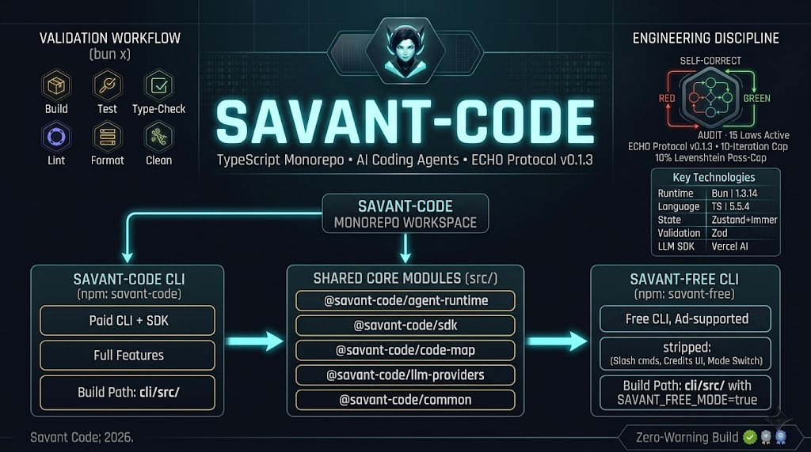

<!-- markdownlint-disable MD041 -->


# @savant-code/evals

Eval harness for the Savant agent. Runs the **benchmark v2** suite (deterministic-first, ECHO-native task runner)
and the **graph-export e2e** Playwright suite, tracing per-task performance and FSM compliance.

[](../LICENSE)[](../ECHO.md)[](../README.md)

## Purpose

`@savant-code/evals` is the regression gate for agent quality. Benchmark v2 feeds a curated registry of YAML tasks
into a SavantCode run, verifies deterministic check commands (tests, typechecks, lints), and scores ECHO FSM phase
compliance, subagent utilization, and custom-tool usage from the captured trace. Run before/after any agent-runtime
or model change to detect capability regressions. The runner consumes `@savant-code/code-map` (for source parsing),
`@savant-code/common` (for tool schemas), and `@savant-code/sdk` (for the harness driver).

## Quick Start

```bash
# From the repo root
bun install

# Run benchmark v2 unit tests
bun --cwd evals test:v2

# Run the v2 harness in baseline mode (validates tasks against golden patches)
bun --cwd evals harness:v2

# Run the graph-export Playwright e2e suite
bun --cwd evals test:graph-e2e

# Type-check
bun --cwd evals typecheck
```

See `evals/v2/README.md` for the task schema, harness modes, and runner interfaces.

## License

[Apache-2.0](../LICENSE) — see [LICENSE](../LICENSE) for full text.

---

<div align="center">

_Part of the [savant-code/savant-code monorepo](https://github.com/savant0x/savant-code), governed by the [ECHO
Protocol v0.2.0](../ECHO.md)._

**Savant** • 2026
</div>
